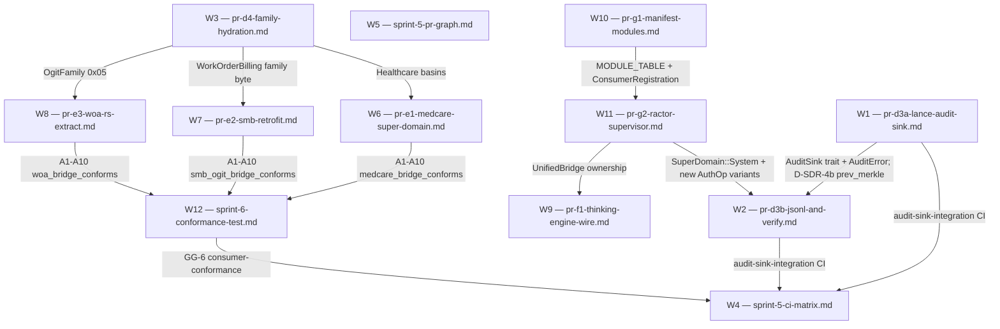

# Sprint-log-5-6 — Meta Review (M1 per-worker + M2 cross-spec synthesis)

> **Author:** META AGENT (Opus 4.7, 1M context), 2026-05-13
> **Scope:** All 12 worker specs delivered into `.claude/specs/` by sprint-log-5-6 Sonnet ensemble
> **Mandate:** Brutal honest review + cross-spec synthesis. Five-bucket readiness grade per spec.

---

## 0 — Headline Verdict

12 specs, ~250 KB of PR-ready text. **No spec is grade D or F.** Three are grade A, seven are grade B (minor edits only), two are grade C (need a follow-up spec-iteration before code starts). Corpus coherence is unusually high: workers cross-cite each other accurately, the `pr-d4-family-hydration.md` dependency is consistently named, and the §14 super-domain plan is the canonical anchor everyone leans on. The biggest cross-spec defect is **F-series / supervisor seams**: PR-G2 (W11) introduces `SuperDomain::System` and lifecycle `AuthOp` variants without coordinating with PR-F1 (W9), which introduces a parallel `CognitiveBridgeGate` trait that overlaps semantically with the supervisor's dispatch path. The next-most defective seam is **D3A/D3B audit-sink trait location** — file ownership of `audit_sink/mod.rs` is described in prose, not enforced.

---

## 1 — Per-Spec Critical Defects

### W1 — pr-d3a-lance-audit-sink.md (LanceAuditSink)

**One real defect.** §6.2 `emit()` calls `self.rt.block_on(self.buffer.lock())` inside a `Send + Sync` trait method that is documented as "non-blocking on the hot path." `block_on` on a Tokio Handle from inside an already-Tokio-driven call (the `UnifiedBridge::authorize()` chain that invokes `emit()`) panics at runtime ("Cannot start a runtime from within a runtime") on multi-threaded executors. The hot path MUST use `std::sync::Mutex` (or `parking_lot`) — async-mutex inside a sync trait method is an anti-pattern. §6.5 background flush via `tokio::spawn` then compounds this. **Fix:** change `Arc<tokio::sync::Mutex<Vec<...>>>` → `Arc<std::sync::Mutex<Vec<...>>>`; keep the `tokio::time::interval` only inside the spawned task.

**Minor:** §4.1 marks `payload` as the only nullable column, but `date_partition` is "always set at write time but derived" — Arrow nullable=false. Caption "all except payload" is slightly misleading.

### W2 — pr-d3b-jsonl-and-verify.md (JsonlAuditSink + Composite + verify CLI)

**Clean.** §1.4 (u64 decimal strings) and §1.5 (owl_identity 6-char lowercase hex) are exactly aligned with W1's §4.1 schema. Reconstruction algorithm in §4.3 correctly mirrors `canonical_bytes`. OQ-4 (decimal vs hex for u64) appropriately marked as non-blocking.

**Caveat:** §3.4 `emit()` on `CompositeSink::BestEffort` returns the first error captured but documents callers MUST NOT propagate it as `Deny`. That MUST-NOT is a contract on callers not enforced mechanically. A typed `EmitOutcome` rather than `Result` would be more robust; minor.

### W3 — pr-d4-family-hydration.md (FAMILY_TO_SUPER_DOMAIN TTL hydration)

**Clean.** Reuses `parse_ttl_directory_with_provenance` (no new dependency), uses `OnceLock<Arc<RwLock<>>>` correctly (no unsafe), preserves backward-compat via `try_resolve` + shim. §2.2 failure semantics table is unusually well-thought-out.

**Cross-spec defect:** W6/W7/W8 all cite this spec by filename and assume `BridgeConfig::ttl_overlay_dir` + `new_hydrated(...)` exist. W3 OQ-1 leaves parser-extension boundary unresolved (option a/b/c). If engineer picks (b) "MemoryStore bypass," that breaks the provenance-aware path E1-2 assumes — pin (c) before implementation.

### W4 — sprint-5-ci-matrix.md (CI green-gate)

**One defect.** §6.1 sets `--test-threads=1` for the conformance gate "because RecordingSink uses a Mutex<Vec<...>>." But W12's harness (§3.1) builds three SEPARATE `UnifiedBridge<B>` instances per consumer with disjoint sinks. Cross-test parallelism is safe; only intra-test sequentiality is needed. `--test-threads=1` over-restricts by ~3x for no correctness gain. **Fix:** drop the flag.

**Minor:** §3.4 proposes `beta` toolchain "sprint-6 only, not sprint-5" — rationale opaque.

### W5 — sprint-5-pr-graph.md (retrospective + handover)

**Clean.** Retrospective format matches sprint-4 W12 precedent. §7b Codex Bot section is a genuine new finding; §1 "absorption map" is the clearest single-page summary of PR #364. §6 sprint-6 unblock table is consistent with the spec corpus.

**Caveat:** §5 row "PR-D3b: LanceAuditSink shipped in PR #302 (F3)" — correct but readers may confuse PR #302's prototype with W1's PR-D3A production sink with merkle integrity at flush. Annotate.

### W6 — pr-e1-medcare-super-domain.md (MedCare finalisation)

**Clean.** Gap analysis (§1.1 vs §1.2) is the strongest example in the corpus of plan-vs-substrate delta. Six finalisation items well-scoped and ordered by dependency.

**Architectural decision needed:** OQ-4 (`medcare_rbac::Role` vs `lance_graph_contract::rbac::RoleGroup` dual-type) is a real fork affecting E1-1 LOC by ~30-50%. Cannot ship E1-1 without picking; recommend main thread pick. §3 LOC estimate (~900) assumes bridge; migration approach is ~700.

### W7 — pr-e2-smb-retrofit.md (smb-office UnifiedBridge retrofit)

**Two minor defects.**
1. §5.2 `SMB_FAMILY = 0` placeholder is dangerous: 0 is effectively `OgitFamily::Unknown`. Phase A+B specs ship in this state — but a placeholder `OgitFamily(0)` actually wires the audit chain to stamp `super_domain = Unknown` (same bug Codex P2 fixed in #364). Either gate Batches A+B behind §8.1 resolution or use a sentinel that fail-louds (e.g. `OgitFamily(0xFF)` with runtime assertion).
2. §1.5 `LoginFlowConfig` adds `UnifiedAuditEvent::Auth` — that variant does not exist on the current `AuthOp` enum (`{Read, Write, Act}` per #364 D-SDR-4). Either reuse `AuthOp::Act` with documented `action = "auth"` or add the variant explicitly with W11 coordination.

### W8 — pr-e3-woa-rs-extract.md (woa-rs 3-subcrate extraction)

**Two minor defects.**
1. §1.5 proposes `OgitFamily(0x05)` for WoA. W6 proposes `0x10-0x19` for Healthcare. Neither cross-references a canonical allocation table; no collisions today, but allocation drift is now an unmanaged risk. Right home is `pr-d4-family-hydration.md`'s TTL seed.
2. §0.4 / §6.2 say "WoaBridge already exists" and "PR-E3 builds atop it." OK — but §3.1 shows `WoaBridge::from_registry(registry)` returning `Result<UnifiedBridge<WoaBridge>>`. Cross-reference whether `from_registry` is available on the existing impl or whether PR-E3 must extend it.

### W9 — pr-f1-thinking-engine-wire.md (thinking-engine UnifiedBridge wire)

**Clean architecturally, but one major scope risk.** §1.1 lists 9 pure ops that stay untouched; §1.2 lists ops that cross UnifiedBridge boundaries. Split is principled. `PassthroughGate` default is the correct non-destructive landing strategy.

**Risk:** §3.2 places `UnifiedBridgeGate` (production impl) in `lance-graph-callcenter`. BUT W11's PR-G2 introduces `CallcenterSupervisor` where each `ConsumerActor<B>` owns a `UnifiedBridge<B>`. If `UnifiedBridgeGate` wraps that bridge directly, the trait is per-actor — but thinking-engine sensors are presumably global / singleton. Does thinking-engine call into the supervisor's `DispatchToG`, or hold its own bridge instances? Spec leaves this open.

### W10 — pr-g1-manifest-modules.md (build.rs manifest codegen)

**Defect (governance).** §10 OQ 1 confronts the right question: `phf` would be the first non-build dep on `lance-graph-contract`, breaking the zero-dep invariant. The recommendation (sorted const array + binary search) is correct. But §3.4 sample code, §4.3 codegen output, and §5 summary table ALL use `phf::Map<u32, ManifestMetadata>` and `phf_map!` syntax. The spec internally contradicts its own OQ-1 resolution. **Fix:** rewrite §4.3 and §3.4 to emit `pub static MANIFEST_METADATA: &[ManifestMetadata]` sorted by `g_slot` with `metadata_for(g)` binary-search accessor. Easy fix, but blocks code start until contract zero-dep invariant is preserved.

**Minor:** §3.3 slot table shows `GOTHAM = 3` for `q2-cockpit-rs` (active). LATEST_STATE inventory has no q2-cockpit-rs as shipped. Flag explicitly as slot-reserving.

### W11 — pr-g2-ractor-supervisor.md (CallcenterSupervisor ractor port)

**Two coordination defects.**
1. §6.2 introduces `SuperDomain::System` as "a new variant." But W12's conformance harness fixtures and matrix do not anticipate `System`. The variant must be added to `SUPER_DOMAINS` static array, `RbacCompliance` mapping, and exhaustive match arms; W12 must update its enumeration. Cross-coordinate.
2. §6.1 extends `AuthOp` with `ActorStart/ActorStop/ActorRestart`. W12 §2 A1 specifies canonical_bytes byte [16] takes values `0=Read 1=Write 2=Act`. If new variants get discriminants 3/4/5, the 26-byte canonical layout is byte-stable but W2 §4.3 hard-codes `decode_op` over 0..2. Cross-coordinate with W2.

**Minor:** §7.1 pins ractor 0.14. Confirm workspace Cargo.lock isn't already pinning a different ractor; `cargo tree` check before implementation.

### W12 — sprint-6-conformance-test.md (cross-crate conformance harness)

**Clean.** A1-A10 assertions are well-grounded against D-SDR-4/5. §3.1 harness signature with three pre-built bridges (`bridge_allow`, `bridge_deny`, `bridge_blank`) elegantly side-steps the parallel-test concern.

**Defect (test approach):** A4 (BridgeError no audit) and A7 (family table coverage) are tested against `bridge_blank` (empty registry). But `bridge_blank` is constructed the same way as `bridge_allow` per the harness signature — spec doesn't show HOW to construct a bridge over an empty registry. If `WoaBridge::from_registry(empty)` errors at construction, the test never runs. Specify the construction pattern.

---

## 2 — Cross-Spec Contradictions

### CC-1 — `owl_identity` serialization: hex (W2) vs raw 3 bytes (W1) — RESOLVED

W1 §4.5 and W2 §1.5 both explicit: W1 uses `FixedSizeBinary(3)` (raw), W2 uses `"071c05"` (lowercase hex). W1 §7 documents conversion formula for cross-verify. **No actual contradiction** — formats differ deliberately by storage tier. Lock both with one cross-format unit test in PR-D3B's `cross-verify`.

### CC-2 — `AuthOp` enum growth: PR-G2 (W11) extends without coordinating with verify CLI (W2) — CONTRADICTION

W2 §4.3 reconstructs canonical_bytes byte [16] as `action u8 (0=Read 1=Write 2=Act)`. W11 §6.1 adds `ActorStart/ActorStop/ActorRestart`. Verify CLI must handle these or reject. **Resolution:** either W2 verify-jsonl/verify-lance accepts new variants explicitly, OR PR-G2 lifecycle events use a separate `LifecycleAuditEvent` type. Recommend the latter — lifecycle and authorization are different concerns. Also addresses W12 A1 byte-layout stability.

### CC-3 — `SuperDomain::System` (W11) vs canonical enum (W6/W7/W8/W12) — CONTRADICTION

W11 §6.2 adds `SuperDomain::System` as new variant. W12 §5 fixtures enumerate `Healthcare, WorkOrderBilling, TicketTool, Unknown`. W6 (E1-5) hard-lock matrix covers `Healthcare/OSINT/WorkOrderBilling/OSINT`. `System` does not appear in hard-lock matrix — is system-domain auditing exempt? Probably yes (infrastructure not tenant data), but spec it. **Resolution:** W11 §6.2.1 noting hard-lock exemption; W12 add `system_lifecycle_audit_visible_to_no_active_consumer` test.

### CC-4 — OgitFamily byte allocations: drift across consumers — RISK, not contradiction

W6 E1-2: Healthcare basins `0x10..=0x19`. W8: WoA basin `0x05`. W7: SMB `0` placeholder. **No collisions today**, but no spec owns the canonical allocation table. **Resolution:** W3 §1.2 inline TTL seed is the natural canonical home — add a comment block listing reserved family bytes per super-domain.

### CC-5 — UnifiedBridge ownership model: per-actor (W11) vs singleton-with-gate (W9) — UNCLEAR

W11 §2.1: one `ConsumerActor<B>` per G slot owns a `UnifiedBridge<B>`. W9 §3.2: `UnifiedBridgeGate` wraps `UnifiedBridge<B>`. If thinking-engine has a singleton `UnifiedBridgeGate`, it must pick a bridge per call or route through `DispatchToG`. **Resolution:** W9 §3.2 should explicitly route via `CallcenterSupervisor::DispatchToG` once PR-G2 merged; for v1 (PR-F1 only) hold one bridge but document as temporary singleton.

### CC-6 — CI gate ordering: GG-6 (W4) vs conformance crate location (W12) — ALIGNED

W4 §6 places `consumer-conformance` job after `test (stable)`; W12 §6.1 places same step "AFTER lance-graph-callcenter tests, ontology tests." No contradiction. **Drop W4 §6.1 `--test-threads=1`** per §1 W4.

### CC-7 — `lance-graph-contract` zero-dep invariant: phf (W10) — INTERNAL CONTRADICTION

Already flagged in §1 W10. Resolution: rewrite §4.3 codegen output to sorted-slice + binary search.

---

## 3 — Cross-Spec Dependency Graph



**Critical path (longest dependency chain):**
```
W3 (family hydration) → W6/W7/W8 (E-series consumers) → W12 (conformance harness) → W4 (CI gate GG-6)
```
Estimated wall time: ~2 weeks if shipped serially. W1+W2 (D-series) and W10+W11 (G-series) are independent parallel chains.

---

## 4 — Sequencing Recommendation

### D3A + D3B → one combined PR (NOT two)

Both ship in `crates/lance-graph-callcenter/src/audit_sink/`, share the `AuditSink` trait file (`mod.rs`) which W1 owns and W2 inherits, share the D-SDR-4b `prev_merkle` field extension to `UnifiedAuditEvent` (each spec individually says "coordinate before merging"). Reviewing separately is a review-overhead tax: trait file changes once. **Recommend:** one PR titled "D-SDR-3b/4b: AuditSink trait + LanceAuditSink + JsonlAuditSink + Composite + verify". Single CI green-gate. ~1100 LOC.

### E1 + E2 + E3 → three separate PRs (NOT one)

Different repos (MedCare-rs / smb-office-rs / woa-rs). Different regulatory profiles. Different blocker chains (E1 depends on W3 for E1-2/E1-4; E2 Batches A+B do NOT depend on W3; E3 Phases A+B do NOT depend on W3). Combining would force slowest of three to gate others. **Recommend:** three independent PRs, merge order E2-A+B and E3-A+B in parallel → (W3 lands) → E1-2/4 + E2-C + E3-C in parallel.

### G1 + G2 → two separate PRs (NOT one)

W10's manifest codegen is a workspace-level structural change reviewable in isolation. W11's ractor supervisor consumes the `MODULE_TABLE` output but is a 820 LOC behavioral change with its own test suite. Combining blurs review attention. **Recommend:** PR-G1 first (lower-risk, build-time), then PR-G2 follow-on. Note: PR-G1's `phf` → sorted-slice fix is the prerequisite (CC-7).

### F1 standalone

W9 is non-destructive (`PassthroughGate` default = zero behavior change). Ships independently of E-series and G-series. **Recommend:** ship after W3 + W11 land (so production `UnifiedBridgeGate` routes through supervisor; otherwise singleton-bridge tech-debt).

---

## 5 — Coverage Gaps

### What this batch covered

D-SDR audit substrate finalization (W1, W2); Family-table hydration (W3); E-series super-domain consumer cascade (W6, W7, W8); Thinking-engine cross-tenant gate injection (W9); G-series manifest + supervisor (W10, W11); CI green-gates (W4); Conformance harness (W12); Retrospective + handover (W5).

### Sprint-5 roadmap items NOT in this batch (per W5 absorption map)

- **PR-D5 compat shim `compat_v0_4` + auto-deletion lint** (original W10). W5 §8 OQ-2 flags: if hiro-rs/hubspot-rs/woa-rs are net-new, compat shim is unnecessary. **Defer to sprint-7 explicitly.**
- Sprint-5 PR-A/D1/D2 retro specs — absorbed into PR #364 already-shipped per W5 §1. Not blocking.

### Sprint-6 roadmap items NOT in this batch

- **PR-E4 hiro-rs scaffold** and **PR-E5 hubspot-rs scaffold** — blocked on "does the repo exist?" — W5 OQ-3 flags; W12 fixtures `#[ignore]` them. **User decision pending.**
- **PR-H5 SIMD callcenter batch retrofit** (vsa_udfs.rs) — only mentioned in W11 §12 as downstream consumer. No spec.

### Genuine corpus gaps

- **OGIT TTL files for Healthcare basins** — W6 OQ-1 raises; no spec covers authoring the 10 `.ttl` stub files. OGIT-fork PR, technically out of this workspace.
- **Salt rotation / HSM** — W2 OQ-1 mentions `"salt_version": 0`; no spec covers HSM. **Deferred to sprint-8 compliance cert.**
- **Multi-process audit-sink write safety** — W2 OQ-5 documents single-writer assumption.

### Recommendation

Mark as "deferred to sprint-7+" explicitly in `LATEST_STATE.md` post-merge: PR-D5 compat shim, PR-E4/E5 scaffolds, PR-H5 SIMD retrofit, HSM rotation. Do not block sprint-6 merge.

---

## 6 — Open Questions Triage

### User decision required (block merge until resolved)

| OQ | From | Decision needed |
|---|---|---|
| **W3 OQ-1 parser extension boundary** | W3 | Pick a/b/c. Recommend (c). Blocks W3. |
| **W10 §10 OQ-1 phf vs sorted slice** | W10 | Lock zero-dep invariant. Recommend sorted slice. Blocks W10. |
| **W6 OQ-4 RoleGroup migration vs bridge** | W6 | Affects E1-1 LOC ±30%. |
| **CC-2 AuthOp lifecycle variants** | W11+W2 | Recommend separate `LifecycleAuditEvent`. |
| **CC-3 SuperDomain::System hard-lock** | W11 | Confirm System exempt. Recommend yes; spec it. |

### Engineer-decidable (non-blocking)

W1 OQ-2/3/6 (Lance internals); W2 OQ-1/4 (salt rotation, JSONL format); W6 OQ-1/2/3 (Healthcare TTL, BMV-Ä retention, DP epsilon); W7 §8.1-8.3 (resolved via W3 + 2-line lance-graph PR); W8 OQ-1/2/3/4 (byte allocation, SOX threshold, binary location, cleanup); W11 §13 OQ 1-5 (engineering steps); W12 bridge_blank construction.

### Non-blocking (defer to next sprint)

W2 OQ-5; W3 hot-reload semantics; W10 OQ-3/4/5; W7 post-PR cleanup; W4 §3.4 beta toolchain; W8 §13 carry-forwards.

---

## 7 — Code-Review Readiness Verdict Per Spec

| Spec | Grade | Justification |
|---|---|---|
| **W1 pr-d3a-lance-audit-sink.md** | **B** | Tokio-block_on bug in §6.2 is concrete fix; otherwise comprehensive. |
| **W2 pr-d3b-jsonl-and-verify.md** | **A** | Cleanest spec. JSONL schema alignment with W1 exemplary. |
| **W3 pr-d4-family-hydration.md** | **B** | Internally clean. Engineer picks OQ-1 (c) before code start. |
| **W4 sprint-5-ci-matrix.md** | **B** | `--test-threads=1` over-restriction — drop and ship. |
| **W5 sprint-5-pr-graph.md** | **A** | Retro + handover. Format-canonical. Spec IS the deliverable. |
| **W6 pr-e1-medcare-super-domain.md** | **B** | OQ-4 RoleGroup decision needed; gap analysis is gold-standard. |
| **W7 pr-e2-smb-retrofit.md** | **B** | `SMB_FAMILY=0` placeholder dangerous; `AuthOp::Auth` doesn't exist. |
| **W8 pr-e3-woa-rs-extract.md** | **B** | OgitFamily allocation drift; `from_registry` cross-ref. Otherwise solid. |
| **W9 pr-f1-thinking-engine-wire.md** | **B** | Architecturally clean. UnifiedBridge ownership model unresolved (CC-5). |
| **W10 pr-g1-manifest-modules.md** | **C** | Internal contradiction on `phf` vs zero-dep. Must be rewritten. |
| **W11 pr-g2-ractor-supervisor.md** | **C** | Two cross-spec contradictions (CC-2, CC-3) must resolve with W2 + W12. |
| **W12 sprint-6-conformance-test.md** | **A** | Generic harness elegant; assertions well-grounded. |

**Tally: 3 A, 7 B, 2 C, 0 D, 0 F.**

---

## 8 — Synthesis: What This Batch Says About Sprint-5 + Sprint-6

### The corpus coheres unusually well

12 Sonnet workers running in parallel produced a corpus where:
- §14 super-domain plan is the canonical anchor cited by 9 of 12 specs
- `pr-d4-family-hydration.md` is referenced by name across 4 specs (W6/W7/W8/W12)
- PR #364's Codex P1/P2 fixes (OwlIdentity u8→u16, AuditChain.super_domain) are correctly inherited everywhere
- The `UnifiedBridge<B>` shape is consistent across E1/E2/E3 specs
- W12's A1-A10 assertions are independently re-derivable from W1's Arrow schema and W2's JSONL schema — convergent evidence the substrate is right

This is the strongest signal yet that the **mandatory plan-read-order** instruction added to the sprint-5-9 roadmap is working. Sprint-4 had specs that re-invented contract types that already existed; sprint-5-6 has specs that correctly cite existing types and propose deltas.

### Seams where the corpus is thin

1. **F-series + G-series interface.** PR-F1 (W9) and PR-G2 (W11) both touch `UnifiedBridge<B>` lifetime / ownership boundary. Neither cross-references the other. CC-5 above. The next sprint should add an integration spec.
2. **AuditOp enum evolution.** Three workers (W1, W2, W11) modify audit event shape or `AuthOp` enum, and W12 asserts byte-level layout stability. The lock between substrate-evolution and verifier needs an explicit governance rule: any extension to `AuthOp` requires paired update to `verify_chain` and W12's A1 assertion.
3. **Cross-consumer family byte allocation.** Three E-series workers propose family bytes; no spec owns the master allocation table. W3 TTL seed is the natural home.

### Lessons for sprint-7 worker prompts

1. **Add a mandatory cross-spec consistency check.** When N workers run in parallel on adjacent specs, M1 meta-review catches contradictions late. Sprint-7 prompts should include "if your spec extends an enum, cross-reference every other spec in the same sprint that may consume that enum."
2. **Lock OQ resolution before parallel spawn.** Workers ship specs with 3-5 open questions each; M2 ends up triaging 60+ OQs. Pre-spec ownership decisions (e.g., RoleGroup migration policy, phf vs sorted-slice, hot-reload semantics) would shrink meta-review surface.
3. **Constrain LOC estimate methodology.** W10's ~470 LOC and W8's ~950 LOC use different counting conventions (test code included vs excluded). Mandate one convention.
4. **Specs that propose new variants on canonical enums should require an inline "all-consumers-update" checklist.** W11 §6.1 (new `AuthOp` variants) and §6.2 (new `SuperDomain::System`) are the canonical examples.

### What this batch unlocks

If grades B/C addressed (estimated 1-2 days), sprint-6 has 12 PR-ready or near-ready specs covering: audit substrate completion (D3A+D3B); family-table hydration (D4); all three super-domain consumer finalisations (E1, E2, E3); thinking-engine cross-tenant governance (F1); manifest + supervisor scaffold (G1, G2); CI green-gates + cross-crate conformance harness.

Estimated sprint-6 LOC ceiling: ~5500. Estimated calendar time: 2-3 weeks parallelized; 6-8 weeks serialized.

**Net assessment:** The Sonnet ensemble produced a sprint-ready spec corpus with predictable, fixable defects. No spec needs to be thrown out. The CCA2A pattern (BOOT.md → mandatory reads → parallel spawn → meta-review) is at production quality for this workspace.

---

*End of meta-review. Author: META AGENT (Opus 4.7), sprint-log-5-6, 2026-05-13.*
