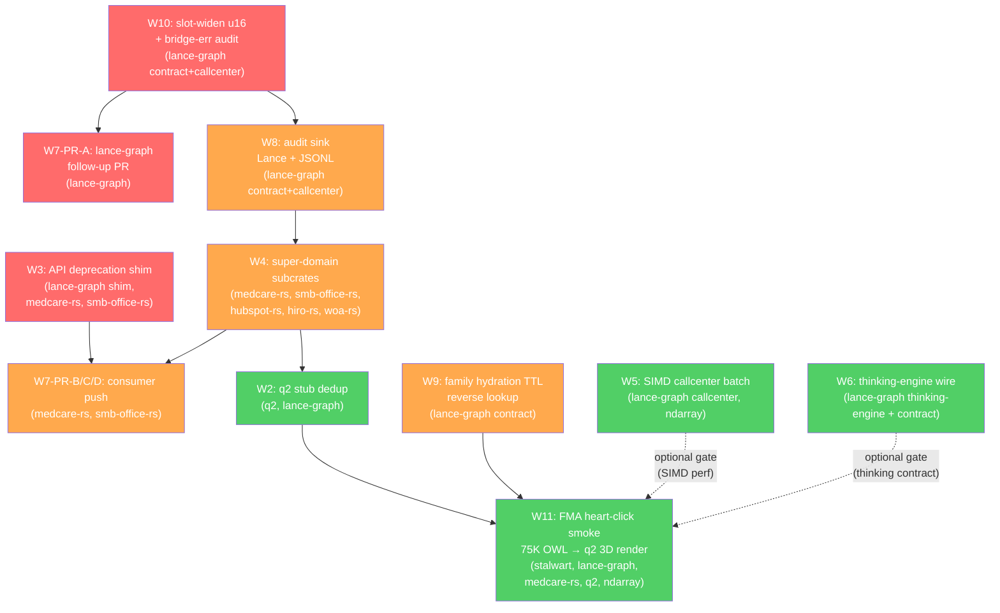

# Sprint-4 Cross-Repo PR Sequencing Graph

> **Generated:** 2026-05-13  
> **Branch:** `claude/lance-datafusion-integration-gv0BF`  
> **Worker:** W12 — dependency analysis + merge-wave orchestration  
> **Source:** SPRINT_LOG.md + W1–W11 spec table (see sprint manifest)

---

## 1. Dependency Graph



**Legend:** Red = Wave 1 (Day 0), Orange = Wave 2 (≤Day 3), Green = Wave 3 (≤Day 10).  
Solid arrows = hard dependency (must merge before). Dashed arrows = soft gate (can be bypassed with known risk).

### Critical chain

```
W10 (slot widen u16 + bridge-err audit)
  → W8 (audit sink — Lance/JSONL)
    → W4 (super-domain subcrates)
      → W2 (q2 stub dedup)
        → W11 (FMA heart-click smoke)
```

**Rationale:** W10 widens `entity_type_id` from u8→u16 in `owl_from_schema_ptr`; W8 depends on the stable audit contract that W10 fixes (BridgeError must emit before sink can persist). W4 introduces the subcrate hierarchy that W2's re-exports target. W11 is the integration demo and requires every upstream fix to compile.

**Gate:** W3 (deprecation shim) must land before W7-PR-B/C/D (consumer push). W7-PR-A (lance-graph follow-up) may co-land with W10 on Day 0.

**Parallel paths** (no hard dependency on critical chain):
- W5 — SIMD callcenter batch: isolated to `callcenter/` + `ndarray`; no contract changes.
- W6 — thinking-engine wire: isolated to `thinking-engine/` + `contract`; additive only.
- W9 — family hydration TTL: `contract` reverse-lookup table; no consumer schema change.

---

## 2. Per-Repo PR Table

| Repo | PR Title (proposed) | Depends-on | Blocks | Est. LOC | Owner |
|---|---|---|---|---|---|
| lance-graph | `fix(contract): widen entity_type_id u8→u16; BridgeError audit hook` | — | W8, W7-PR-A | ~200 | W10 |
| lance-graph | `fix(shim): deprecation path for D-SDR-1..5 mid-flight API drift` | — | W7-PR-B/C/D | ~300 | W3 |
| lance-graph | `chore: open D-SDR follow-up PR; release notes for commits #355-#363` | W10 | — | ~150 | W7 |
| lance-graph | `feat(audit): Lance + JSONL sink for UnifiedAuditEvent` | W10 | W4 | ~400 | W8 |
| lance-graph | `fix(contract): FAMILY_TO_SUPER_DOMAIN TTL hydration + reverse lookup` | — | W11 | ~200 | W9 |
| lance-graph | `perf(callcenter): replace scalar loop with ndarray::simd batch paths` | — | W11 (soft) | ~350 | W5 |
| lance-graph | `feat(thinking-engine): wire 582 KB cognitive substrate to UnifiedBridge` | — | W11 (soft) | ~500 | W6 |
| medcare-rs | `feat: super-domain specialisation (medcare-analytics + medcare-bridge)` | W8 | W7-PR-B, W11 | ~300 | W4 |
| medcare-rs | `feat: adopt deprecation shim + push UnifiedBridge wiring` | W3, W4 | W11 | ~150 | W7 |
| smb-office-rs | `feat: super-domain specialisation (smb-bridge subcrate)` | W8 | W7-PR-C, W11 | ~200 | W4 |
| smb-office-rs | `feat: adopt deprecation shim + push UnifiedBridge wiring` | W3, W4 | W11 | ~150 | W7 |
| hubspot-rs | `feat: new super-domain subcrate (hubspot-bridge)` | W8 | W11 | ~100 | W4 |
| hiro-rs | `feat: new super-domain subcrate (hiro-bridge)` | W8 | W11 | ~100 | W4 |
| woa-rs | `feat: new super-domain subcrate (woa-bridge)` | W8 | W11 | ~100 | W4 |
| q2 | `fix: lance-graph + q2-ndarray stubs become re-exports (dedup)` | W4 | W11 | ~300 | W2 |
| lance-graph | `test(smoke): FMA heart-click end-to-end (75K OWL → q2 3D render)` | W2, W9, W5*, W6* | — | ~600 | W11 |
| ndarray | `(no PR — consumed as dep; version pin bump only)` | — | W5, W11 | ~0 | W5 |
| stalwart | `(no code PR — infra config for FMA demo endpoint)` | — | W11 | ~50 | W11 |

\* Soft gate — W11 can land without W5/W6 merged, but CI smoke may be slower or skip thinking-engine coverage.

---

## 3. Merge Waves

### Wave 1 — P0 Unblockers (Day 0, same business day)

| PR | Repo | Blocker resolved |
|---|---|---|
| W10: slot widen u16 + bridge-err audit | lance-graph | Critical chain head; fixes silent truncation + audit gap |
| W3: API deprecation shim | lance-graph | Gates W7-PR-B/C/D consumer migration |
| W7-PR-A: follow-up PR open + release notes | lance-graph | Closes TD-SDR-PR-FOLLOWUP-1; unblocks external consumers seeing stale main |

**Constraint:** All three must merge the same calendar day. W10 and W3 are independent and can be reviewed in parallel. W7-PR-A depends only on W10 being merged first (it references the fixed slot type in release notes).

**CI green-gates for Wave 1:**
- `cargo test -p lance-graph-contract` — all contract tests pass with u16 slot
- `cargo test -p lance-graph` — callcenter + BridgeError tests pass
- Deprecation shim: `cargo check -p medcare-rs -p smb-office-rs` with `--features legacy-api` compiles clean
- No `clippy::deprecated` warnings introduced in lance-graph itself

---

### Wave 2 — Consumer Migration (≤Day 3 after Wave 1)

| PR | Repo | Blocker resolved |
|---|---|---|
| W8: audit sink (Lance + JSONL) | lance-graph | TD-SDR-AUDIT-PERSIST-1; required by W4 subcrates |
| W4: super-domain subcrates | medcare-rs, smb-office-rs, hubspot-rs, hiro-rs, woa-rs | TD-SUPER-DOMAIN-SUBCRATES-1; gates W2 |
| W7-PR-B: medcare UnifiedBridge push | medcare-rs | TD-SDR-CONSUMER-PUSH-1 (medcare half) |
| W7-PR-C: smb UnifiedBridge push | smb-office-rs | TD-SDR-CONSUMER-PUSH-1 (smb half) |
| W7-PR-D: (any additional consumer) | (per W7 spec) | TD-SDR-CONSUMER-PUSH-1 tail |
| W9: family hydration TTL | lance-graph | TD-SDR-FAMILY-HYDRATION-1; soft gate for W11 |

**Merge order within Wave 2:** W8 first (audit contract stable), then W4 (new subcrates reference audit types), then W7-PR-B/C/D in parallel (consumer PRs are independent of each other). W9 can merge any time in Wave 2.

**CI green-gates for Wave 2:**
- `cargo test -p lance-graph` — audit sink integration test passes (Lance file created, JSONL written)
- `cargo test -p medcare-rs` — UnifiedBridge smoke test passes
- `cargo test -p smb-office-rs` — UnifiedBridge smoke test passes
- `cargo check -p hubspot-rs -p hiro-rs -p woa-rs` — new subcrates compile
- `FAMILY_TO_SUPER_DOMAIN` reverse lookup test: ≥90% entities resolve non-Unknown after hydration

---

### Wave 3 — Convergence Demo (≤Day 10 after Wave 2)

| PR | Repo | Closes |
|---|---|---|
| W2: q2 stub dedup | q2, lance-graph | TD-Q2-STUBS-DEDUP-1; final compile unblock before FMA |
| W5: SIMD callcenter batch | lance-graph | TD-SIMD-CALLCENTER-BATCH-PATHS-1 |
| W6: thinking-engine wire | lance-graph | TD-THINKING-ENGINE-UNWIRED-1 |
| W11: FMA smoke test | lance-graph (test), stalwart (infra) | FMA demo anchor; convergence proof |

**Merge order within Wave 3:** W2 first (q2 stubs must compile for W11). W5 and W6 can merge in parallel with W2 (no dependency). W11 merges last after W2 + W9 confirmed green, and after W5/W6 optionally merged.

**CI green-gates for Wave 3:**
- `cargo check -p q2` — no duplicate stub warnings, clean compile
- W5: `cargo bench -p lance-graph -- callcenter` — SIMD path used (verified via `simd_caps()` log)
- W6: `cargo test -p lance-graph -- thinking_engine` — UnifiedBridge round-trip test passes
- W11: FMA smoke test end-to-end: 75K OWL loads, ≥1 heart entity resolves through q2 → 3D coords returned

---

## 4. CI Matrix

| Wave | Repo CI jobs required | Green gate condition |
|---|---|---|
| **Wave 1** | lance-graph (contract tests, core tests, clippy) | All pass; u16 slot; no deprecated warnings |
| **Wave 1** | medcare-rs + smb-office-rs (check only, `--features legacy-api`) | Compile clean under shim |
| **Wave 2** | lance-graph (audit sink integration test) | Lance file written; JSONL written |
| **Wave 2** | medcare-rs, smb-office-rs (full test suite) | All pass with new subcrate layout |
| **Wave 2** | hubspot-rs, hiro-rs, woa-rs (check) | Compile clean |
| **Wave 2** | lance-graph-contract (hydration test) | `FAMILY_TO_SUPER_DOMAIN` ≥90% non-Unknown |
| **Wave 3** | q2 (full test suite) | No stub duplication; all pass |
| **Wave 3** | lance-graph (bench: SIMD path active) | `simd_caps().has_avx2()` log visible in bench output |
| **Wave 3** | lance-graph (thinking-engine round-trip) | `UnifiedBridge::route` returns non-error for test input |
| **Wave 3** | lance-graph + stalwart (FMA smoke) | 75K OWL loaded; heart entity → q2 3D coords; exit 0 |

**Blocked-merge rule:** Any CI job listed as required for wave N must be green before the first PR of wave N+1 is merged. Partial wave merges (some PRs in but not all) are allowed as long as the critical-chain dependency order is respected.

---

## 5. Rollback Triggers

Conditions that **block the next wave** from merging:

| Trigger | Condition | Action |
|---|---|---|
| **R1 — Slot regression** | Any test in `lance-graph-contract` or `lance-graph` fails on `entity_type_id` after W10 merges | Revert W10; do not merge W8 |
| **R2 — Audit sink data loss** | Integration test shows events emitted but not persisted (zero rows in Lance table AND empty JSONL) after W8 merges | Revert W8; do not merge W4 consumer PRs |
| **R3 — Consumer compile break** | `cargo check -p medcare-rs` or `cargo check -p smb-office-rs` fails after W4 merges (not under `legacy-api` feature) | Revert affected W4 subcrate PR; do not merge W7-PR-B/C/D |
| **R4 — Stub duplication reintroduced** | `cargo check -p q2` emits duplicate symbol warnings after W2 merges | Revert W2; do not merge W11 |
| **R5 — FMA smoke timeout** | W11 smoke test takes >120s or returns non-zero exit on the 75K OWL load step | Block W11 merge; investigate OWL parser or q2 render path |
| **R6 — Hydration still all-Unknown** | After W9 merges, `FAMILY_TO_SUPER_DOMAIN` test reports >50% Unknown entities | Block Wave 3 merge until W9 root-caused and re-landed |

---

## 6. Open Coordination Questions

**Q1 — hubspot-rs / hiro-rs / woa-rs repo existence:**  
W4's spec proposes three new repos. As of sprint start these are listed as "(new)" in the worker table. Do these repos need to be created and CI-bootstrapped before Wave 2 begins, or will W4 land them as subdirectories of an existing monorepo? This must be resolved before Wave 2 Day-0 work begins. Owner: W4 author + W1 (execution plan).

**Q2 — q2 stub re-export scope:**  
W2 converts local `lance-graph` + `q2-ndarray` stubs to re-exports. It is unclear whether `q2` itself needs to publish a new semver minor (if the stubs were part of its public API) or if this is a pure internal refactor. If a semver bump is required, Wave 3 must account for q2 crate publish time before W11 can reference the corrected types. Owner: W2 author + W11 author (FMA smoke).

**Q3 — thinking-engine UnifiedBridge contract compatibility:**  
W6 wires the 582 KB cognitive substrate to `UnifiedBridge`. W8 and W10 both touch `lance-graph-contract` (audit contract, slot widening). If W6 lands in Wave 3 after W8/W10 have already modified the contract, does W6's branch need a rebase to pick up the new contract types? The answer determines whether W6 can be reviewed independently in Wave 2 prep or must wait until Wave 2 is fully merged. Owner: W6 author + W8 author.

---

*End of sprint-4-pr-graph.md — W12 deliverable.*
