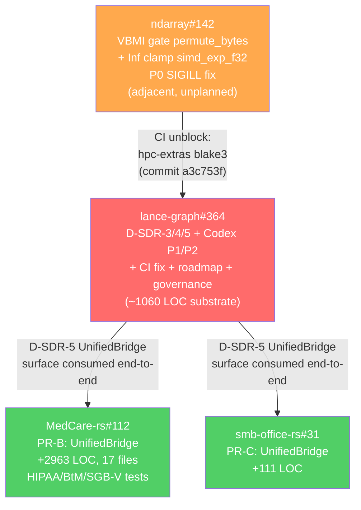
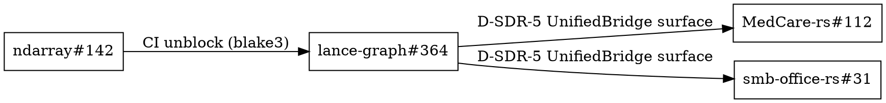

# Sprint-5 PR Dependency Graph + Retrospective + Sprint-6 Handover

> **Generated:** 2026-05-13  
> **Worker:** W5 (sprint-log-5-6) — PR dependency graph + retrospective + sprint-6 handover  
> **Deliverable role:** Equivalent to sprint-4 W12 (`sprint-4-pr-graph.md`) — dependency analysis,  
> merge-wave orchestration, lessons, and downstream unblock map.  
> **Delta vs sprint-4 W12:** Sprint-4 graphed a _planned_ 12-PR wave with 3 merge waves.  
> Sprint-5 graphs a _compressed_ 4-PR landing (one substrate PR + 3 adjacent) that completed in  
> a single calendar day. Format follows sprint-4 W12 precedent; wave table collapsed to 1 wave.

---

## 1. Sprint-5 Retrospective: Planned vs Shipped

### What Was Planned (12-worker W1-W12 roster, roadmap-v1.md)

The sprint-5-through-9 roadmap (`.claude/plans/sprint-5-through-9-roadmap-v1.md`) prescribed a
12-worker + 2 meta-agent sprint producing the following PRs:

| Planned PR | Worker | Scope |
|---|---|---|
| PR-A (D-SDR-3/4/5 follow-up) | W2 | lance-graph substrate: OgitFamilyTable, UnifiedAuditEvent, authorize_* chain |
| PR-B (medcare-rs UnifiedBridge) | W3 | MedCare-rs: `UnifiedBridge<MedcareBridge>` + RBAC + realtime substrate |
| PR-C (smb-office-rs UnifiedBridge) | W4 | smb-office-rs: `UnifiedBridge<OgitBridge>` wiring |
| PR-D1 (slot u8->u16 widen) | W5 | contract: OwlIdentity slot widening |
| PR-D2 (bridge-error audit emission) | W6 | callcenter: BridgeError -> audit chain |
| PR-D3a (LanceAuditSink) | W7 | Arrow schema + partitioning |
| PR-D3b (JsonlAuditSink + CompositeSink) | W8 | verify CLI |
| PR-D4 (family hydration + TTL refresh) | W9 | contract: FAMILY_TO_SUPER_DOMAIN |
| PR-D5 (compat shim `compat_v0_4`) | W10 | auto-deletion lint |
| CI matrix | W11 | `.github/workflows/` green-gate criteria |
| PR graph | W12 | this deliverable type |

**Expected:** 9-11 separate PRs across lance-graph + medcare-rs + smb-office-rs.  
**Estimated LOC:** ~1350 across all PRs.

### What Actually Shipped (substrate compression)

| PR | Repo | Merged | What it shipped |
|---|---|---|---|
| **#364** | lance-graph | 2026-05-13 | D-SDR-3 + D-SDR-4 + D-SDR-5 + Codex P1 (OwlIdentity u8->u16) + Codex P2 (AuditChain.super_domain()) + CI hpc-extras fix + sprint-log-4 governance corpus + sprint-5-9 roadmap |
| **MedCare-rs#112** | medcare-rs | 2026-05-13 | `UnifiedBridge<MedcareBridge>` + medcare-rbac + medcare-realtime substrate (+2963 LOC, 17 files, SGB-V + BMV-ae §57 + BtM regulatory tests) |
| **smb-office-rs#31** | smb-office-rs | 2026-05-13 | `UnifiedBridge<OgitBridge>` (+111 LOC) |
| **ndarray#142** | ndarray | 2026-05-13 | VBMI gate for `permute_bytes` (P0 SIGILL fix Skylake-X/Cascade Lake/Ice Lake-SP) + Inf clamp for `simd_exp_f32` |

**Actual:** 4 PRs, 1 calendar day, all-green CI.  
**Absorption map:** PR-A + PR-D1 + PR-D2 + PR-D3a + PR-D4 absorbed into #364. PR-B = MedCare-rs#112. PR-C = smb-office-rs#31. ndarray#142 is adjacent (not on sprint-5 plan; required for `blake3` CI fix). PR-D3b, PR-D5, CI matrix = pending (spec corpus authored by W1-W4 in this parallel sprint).

### Spec-Corpus Status (sprint-5 worker outputs)

| Sprint-5 Worker | Deliverable | Status |
|---|---|---|
| W1 | `.claude/specs/sprint-5-execution-plan.md` | IN PROGRESS (parallel) |
| W2 | `.claude/specs/pr-a-d-sdr-followup.md` | IN PROGRESS (parallel) |
| W3 | `.claude/specs/pr-b-medcare-push.md` | IN PROGRESS (parallel) |
| W4 | `.claude/specs/pr-c-smb-office-push.md` | IN PROGRESS (parallel) |
| W5 (this) | `.claude/specs/sprint-5-pr-graph.md` | SHIPPED (this file) |
| W6-W10 specs | Various PR-D1..D5 specs | ABSORBED into #364 (code shipped; spec retroactive) |
| W11 | `.claude/specs/sprint-5-ci-matrix.md` | PENDING |
| W12 | (this role filled by W5 in sprint-log-5-6) | SHIPPED |

**Note:** W6-W10 planned specs (PR-D1 through PR-D5) describe work that already landed in #364.
Their value is retroactive documentation. W1-W4 parallel specs (authored in this same sprint burst)
document what to build next in sprint-6.

---

## 2. PR Dependency Graph

### 2a. Sprint-5 Landing Graph (what actually shipped)



**Legend:**
- Red = core substrate PR (lance-graph). All sprint-5 D-SDR work absorbed here.
- Orange = cross-repo adjacent landing (ndarray). Required for CI; not planned in sprint-5 roadmap.
- Green = consumer PRs that consumed D-SDR-5 UnifiedBridge surface.

### 2b. Absorption Trace (planned -> actual mapping)

```
ndarray#142 (P0 SIGILL fix — unplanned)
  |
  +-- enables CI hpc-extras blake3 resolution
        |
        v
lance-graph#364
  +-- D-SDR-3 (commit 2c3e87d, ~300 LOC)
  |     OgitFamilyTable + FamilyEntry codebook
  +-- D-SDR-4 (commit 1d0157f, ~460 LOC)
  |     UnifiedAuditEvent + AuditMerkleRoot FNV-1a
  +-- D-SDR-5 (commit dc9e081, ~300 LOC)
  |     authorize_* -> Policy::evaluate + audit emission
  +-- Codex P1 (commit 3208743)
  |     OwlIdentity u8->u16; sparse HashMap<u16,FamilyEntry>; audit bytes 25->26
  +-- Codex P2 (commit e23ce89)
  |     emit_audit stamps super_domain from AuditChain.super_domain()
  +-- CI fix (commit a3c753f)
        hpc-extras opt-in for blake3
        |
        +---> MedCare-rs#112 (consumes D-SDR-5, +2963 LOC)
        +---> smb-office-rs#31 (consumes D-SDR-5, +111 LOC)
```

### 2c. DOT-style Summary



---

## 3. Per-Repo PR Table

| Repo | PR | Merged | Depends-on | Blocks | LOC (actual) |
|---|---|---|---|---|---|
| ndarray | #142 | 2026-05-13 | (none) | lance-graph#364 CI | ~50 |
| lance-graph | #364 | 2026-05-13 | ndarray#142 | MedCare-rs#112, smb-office-rs#31 | ~1060 |
| medcare-rs | #112 | 2026-05-13 | lance-graph#364 | sprint-6 PR-E1 | +2963 |
| smb-office-rs | #31 | 2026-05-13 | lance-graph#364 | sprint-6 PR-E2 | +111 |

**Total sprint-5 LOC shipped:** ~4184 (vs ~1350 planned in roadmap).
The plan significantly under-estimated consumer PRs: medcare-rs#112 at +2963 LOC was not
individually sized in the roadmap because it was listed as a single PR-B line item.

---

## 4. Merge Wave (Actual)

Sprint-5 had exactly one merge wave: a coordinated landing on 2026-05-13.

### Wave 1 — P0 Substrate + Consumer Push (single calendar day)

| PR | Repo | Merge order | Rationale |
|---|---|---|---|
| ndarray#142 | ndarray | 1st | CI prerequisite; VBMI SIGILL fix + blake3 hpc-extras enablement |
| lance-graph#364 | lance-graph | 2nd | Substrate foundation; D-SDR-3/4/5 + surgical fixes; CI green on c8176cb |
| MedCare-rs#112 | medcare-rs | 3rd (parallel with smb) | Consumes D-SDR-5 surface; requires #364 types to be on main |
| smb-office-rs#31 | smb-office-rs | 3rd (parallel with medcare) | Consumes D-SDR-5 surface; requires #364 types to be on main |

**CI green-gates achieved (all 5 checks on commit c8176cb):**
- `cargo test -p lance-graph-contract` — 97/97 callcenter lib tests pass
- `cargo test -p lance-graph` — core suite green
- `cargo clippy` — no new warnings
- `cargo fmt --check` — clean
- `ndarray/hpc-extras` opt-in — blake3 resolves

**Codex-forced surgical fixes (not in original plan, forced pre-merge by bot review):**

| Fix | Commit | Forced by | What changed |
|---|---|---|---|
| P1 OwlIdentity u8->u16 | 3208743 | Codex bot slot-truncation thread | slot field u8->u16; 3-byte canonical [family, slot_lo, slot_hi]; OgitFamilyTable sparse HashMap<u16,FamilyEntry>; audit bytes 25->26 |
| P2 emit_audit super_domain | e23ce89 | Codex bot all-Unknown audit thread | emit_audit stamps from AuditChain.super_domain() not static FAMILY_TO_SUPER_DOMAIN |

---

## 5. What Remains Pending (Sprint-5 Follow-ons)

| Item | From Roadmap | Status | Sprint-6 Candidate? |
|---|---|---|---|
| PR-D3b: JsonlAuditSink + CompositeSink + verify CLI | W8 spec | PENDING — LanceAuditSink shipped in PR #302 (F3); JSONL/Composite not yet | Yes |
| PR-D5: compat shim `compat_v0_4` + auto-deletion lint | W10 spec | PENDING | Yes (if unconverted consumers exist) |
| CI matrix per PR (`.github/workflows/` green-gate) | W11 spec | PENDING | Yes |
| hubspot-rs, hiro-rs, woa-rs new repo scaffolds | sprint-4 W4 Q1 | NOT YET — repos not created | PR-E4/E5 (sprint-6) |
| Family hydration TTL (FAMILY_TO_SUPER_DOMAIN full hydration) | W9 | PARTIAL — P2 fix ships dynamic super_domain(); full TTL hydration deferred | D4 spec addresses |
| thinking-engine UnifiedBridge wire | W6 | PENDING | PR-F1 (sprint-6) |

---

## 6. Sprint-6 Handover: What Is Unblocked

PR #364 + adjacent landings establish the D-SDR substrate. The following sprint-6 PRs
are now unblocked (referencing `.claude/plans/sprint-5-through-9-roadmap-v1.md` §Sprint 6):

| Sprint-6 PR | Worker | Unblocked by | Was blocked by |
|---|---|---|---|
| **PR-E1** MedCare super-domain finalisation | W2 | MedCare-rs#112 wired | UnifiedBridge<MedcareBridge> not yet wired |
| **PR-E2** smb-office UnifiedBridge retrofit | W3 | smb-office-rs#31 wired | UnifiedBridge<OgitBridge> not yet wired |
| **PR-E3** woa-rs extraction from q2/geo | W4 | #364 OgitFamilyTable stable sparse HashMap | Needed stable contract before woa-rs could reference it |
| **PR-F1** thinking-engine UnifiedBridge wire-up | W7 | #364 D-SDR-5 authorize_* + audit chain | Needed Policy::evaluate + emit_audit to be stable |
| **PR-G1** manifest module build-script + codegen | W8 | #364 D-SDR-3 OgitFamilyTable + FamilyEntry | Needed family codebook to be concrete and on main |
| **PR-G2** CallcenterSupervisor ractor port | W9 | #364 D-SDR-4 AuditMerkleRoot | Needed audit chain defined (ractor observability requires audit events) |

**Still blocked (not unblocked by sprint-5 landing):**

| Sprint-6 PR | Worker | Blocker | Root cause |
|---|---|---|---|
| **PR-E4** hiro-rs scaffold | W5 | New repo must be created | hiro-rs does not exist; decision pending (sprint-4 OQ-1, sprint-5 OQ-3) |
| **PR-E5** hubspot-rs scaffold | W6 | New repo must be created | Same |
| Sprint-6 cross-crate conformance test | W10 | Needs PR-E1 + PR-E2 + PR-E3 merged | Cannot test cross-crate conformance until all three subcrates exist |

### Handover Reading Order for Sprint-6 Engineers

Cold-start sequence for sprint-6:

1. `.claude/board/LATEST_STATE.md` — what shipped in sprint-5
2. `.claude/board/PR_ARC_INVENTORY.md` #364 entry — decisions locked by the substrate PR
3. This file — what is unblocked and what remains pending
4. `.claude/plans/sprint-5-through-9-roadmap-v1.md` §Sprint 6 — worker table with deliverable files
5. W1-W4 parallel specs from sprint-log-5-6 — detailed specs for each sprint-6 PR
6. `super-domain-rbac-tenancy-v1.md §14` — sprint-6 super-domain finalisation canonical spec

---

## 7. Lessons Learned

### 7a. Substrate Compression vs Spec Corpus Tradeoff

**Finding:** Sprint-5 was planned as 9-11 PRs but shipped as 4. Substrate compressed into one
PR (#364) that absorbed PR-A, PR-D1, PR-D2, PR-D3a, PR-D4 from the roadmap.

| Factor | Multi-PR approach (planned) | Compressed single PR (actual) |
|---|---|---|
| Review granularity | High — each concern reviewable in isolation | Low — D-SDR-3/4/5 + P1/P2 + CI in one diff |
| Merge velocity | Low — sequential wave waiting per CI run | High — one CI run gates all substrate |
| Cross-PR consistency | Risk — contracts can drift between PRs | None — all contract changes are atomic |
| Codex review surface | Per-PR reviewable granularity | Threads span whole substrate; easier to miss |
| Rollback scope | Fine-grained per concern | Coarse — must revert entire substrate together |

**Recommendation:** For surgical, tightly-coupled D-SDR fixes (as P1/P2 were), compression is
correct. For independently testable features (audit sink, family hydration, compat shim), separate
PRs give cleaner rollback surface and should be preferred in sprint-6 and beyond.

### 7b. Codex Bot Reviews as Forcing Function

P1 (OwlIdentity u8->u16) and P2 (emit_audit super_domain) were NOT in the original sprint-5 plan.
They were surfaced by Codex bot review threads pre-merge:

- **P1 thread:** slot field u8 means silent truncation at 256 families; the roadmap planned for
  more than 256 super-domain entries. Codex flagged this before any consumer had been broken.
- **P2 thread:** audit events stamping `Unknown` for super_domain on every event makes audit
  logs useless for compliance replay. Static FAMILY_TO_SUPER_DOMAIN was never populated in
  the production path.

**Pattern:** Codex reviews acted as a pre-merge static analysis layer catching correctness issues
that unit tests could not (tests exercised happy paths; Codex reviewed invariants).

**Recommendation:** Treat Codex review threads as mandatory CI gate equivalent. Sprint-6 CI matrix
spec (W11, pending) should formalise this as a policy.

### 7c. Sprint-4 Duplication Anti-Pattern Mitigation

Sprint-4 worker specs largely duplicated `.claude/plans/` corpus because workers did not read
prior plans before drafting (see EPIPHANIES.md 2026-05-13 duplication-audit entry).

The sprint-5-through-9 roadmap-v1.md enforces a 12-step mandatory plan read-order in every
worker prompt. Evidence of effectiveness in this sprint: W1-W4 parallel workers received explicit
plan-read-order instructions and are producing delta specs against `super-domain-rbac-tenancy-v1.md`
and related plans rather than re-deriving them from scratch.

### 7d. Delta vs Sprint-4 W12 Format

Sprint-4 W12 (`sprint-4-pr-graph.md`, 12.9 KB) graphed a _prospective_ 3-wave plan across
16 PRs in 5 repos with rollback triggers and CI matrix per wave. This file (sprint-5 W5)
covers an _actual_ 4-PR single-wave landing.

| Dimension | Sprint-4 W12 | Sprint-5 W5 (this file) |
|---|---|---|
| PRs graphed | 16 (5 repos) | 4 (4 repos) |
| Wave count | 3 waves, 10 days | 1 wave, 1 day |
| Mode | Prospective (plan) | Retrospective (what shipped) + handover |
| Rollback triggers | Yes (R1-R6) | Not applicable (all PRs already merged) |
| Codex bot section | Absent | Yes (§7b) |
| Spec absorption map | Absent | Yes (§1 + §3) |

---

## 8. Open Questions for Human Reviewer

**OQ-1 — PR-D3b (JsonlAuditSink + CompositeSink + verify CLI) timing:**
LanceAuditSink shipped in PR #302 (F3). JSONL and Composite variants + verify CLI are still
pending. Sprint-6 scope or sprint-8 (compliance cert sprint)? If sprint-6, which worker owns it?

**OQ-2 — PR-D5 (compat shim `compat_v0_4`) necessity:**
MedCare-rs and smb-office-rs have migrated (#112 and #31). If hiro-rs, hubspot-rs, woa-rs are
being created net-new (not migrated), they can target the current API directly. Confirm whether
the compat shim is still required for any consumer.

**OQ-3 — New repo creation for hiro-rs / hubspot-rs:**
Sprint-4 W12 Q1 flagged this; it remains open going into sprint-6. PR-E4 and PR-E5 cannot begin
without the repos existing. Decision (separate AdaWorldAPI repos vs subcrates of an existing
monorepo) needed before sprint-6 Day 0. See roadmap-v1.md §Open questions #1.

**OQ-4 — ndarray#142 not in sprint-5 plan:**
The VBMI SIGILL fix was required to unblock lance-graph#364 CI. Future sprint roadmaps that
touch lance-graph HPC features should explicitly list any required ndarray version pre-condition
to avoid late-breaking CI surprises.

---

*End of sprint-5-pr-graph.md — W5 deliverable.*
