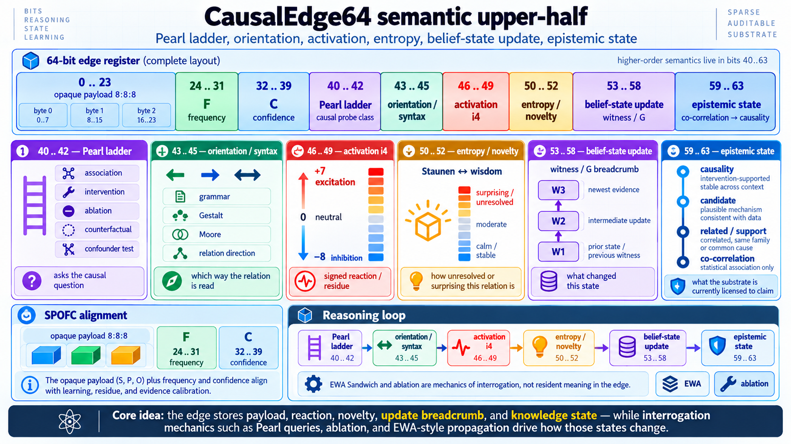

# CausalEdge64: the semantic upper half

The diagram reads bits 40..63 of the 64-bit edge register as a reasoning
loop: a Pearl question goes in, the edge records reaction, novelty and an
update breadcrumb, and its epistemic state says what the substrate may
currently claim. Pearl queries, ablation and EWA-style propagation are the
mechanics that change those states; they are not stored in the edge.

**Status: WORKING-MODEL.** The diagram is a reading of the register, not its
definition. The layout is fixed by `crates/causal-edge/src/layout.rs`
(`_LAYOUT_COVERAGE` asserts all 64 bits are covered exactly once), and bits
59..63 by `lance_graph_contract::epistemic_state5`. Where the diagram names a
band differently from the code, the table below says so. Read the code's name
as current behaviour and the diagram's name as a proposed interpretation.

## Band by band, against the code

| bits | diagram | code today | agreement |
|---|---|---|---|
| 0..23 | opaque payload 8:8:8 | `s_idx`, `p_idx`, `o_idx`: three palette indices | same |
| 24..31 | F, frequency | `frequency_u8` | same |
| 32..39 | C, confidence | `confidence_u8` | same |
| 40..42 | Pearl ladder: asks the causal question | `CausalMask` (`pearl.rs`): `SO` association, `PO` intervention, `SPO` counterfactual, `SP` confounder detection, plus the marginals `None`, `O`, `P`, `S` | same. The diagram's "ablation" row has no mask of its own: ablation is the counterfactual edit (a cut), as the diagram's reasoning loop also says |
| 43..45 | orientation / syntax: which way the relation is read | `direction()`: a 3-bit triad, one "pathological" sign bit per S, P, O plane | different reading. Grammar, Gestalt, Moore and relation direction are not implemented on these bits |
| 46..49 | activation i4: +7 excitation … −8 inhibition | signed i4 inference mantissa: sign = chain direction, magnitude = NARS rule index; +6 Intervention, −6 Counterfactual | different reading. In code this field names the inference operation, not an excitation level |
| 50..52 | entropy / novelty: how unresolved or surprising | `PlasticityState`: one bit per S, P, O plane, hot = accepts palette reassignment under evidence pressure | different reading. Plasticity is related to how settled a plane is, but it is not an entropy measure |
| 53..58 | belief-state update: witness / G breadcrumb | `w_slot()`: witness corpus root handle, 0..=63, 0 = no anchor. The G-slot was dropped in v2 (L-3) | partly. The six bits hold one handle; the W1 → W2 → W3 history in the diagram is not stored in the edge |
| 59..63 | epistemic state: co-correlation → related / support → candidate → causality | `EpistemicState5 = Topology2 × Certification3`. Certification: 0 Open, 1 Associated, 2 Related, 3 Supports, 4 CausalCandidate, 5 Causes. Topology: Direct, IndirectKnown, IndirectUnknown, Unknown | same ladder. The diagram omits `Open` and the topology coordinate (bits 59..60) |

## What the code already enforces from the diagram

- **"Pearl asks the question; it does not certify the answer."**
  `lance_graph_planner::pearl` (D-PEARL-PROD-0) dispatches on bits 40..42 and
  lets only the measured result revise bits 59..63. Only an executed
  intervention (`PO`) can earn `Causes`; the obligations are
  `lance_graph_contract::certification`.
- **"Ablation and EWA are interrogation mechanics, not resident meaning."**
  The counterfactual replay (`lance_graph_planner::dismech_counterfactual`)
  tags its arm with the −6 mantissa and never writes it back as observed
  truth. EWA-style propagation lives in `crates/jc/src/ewa_sandwich.rs` and
  writes no edge field.
- **SPO alignment.** The payload, frequency and confidence feed learning
  and calibration; certification is not derived from them.

## Open

- Whether bits 43..52 should be re-read as orientation, activation and
  novelty. That would change the meaning of bits that existing code writes,
  so it needs a version gate (`I-LEGACY-API-FEATURE-GATED`). It is not done
  here.
- Where a belief-update history longer than one witness handle lives. It is
  not in the edge.
